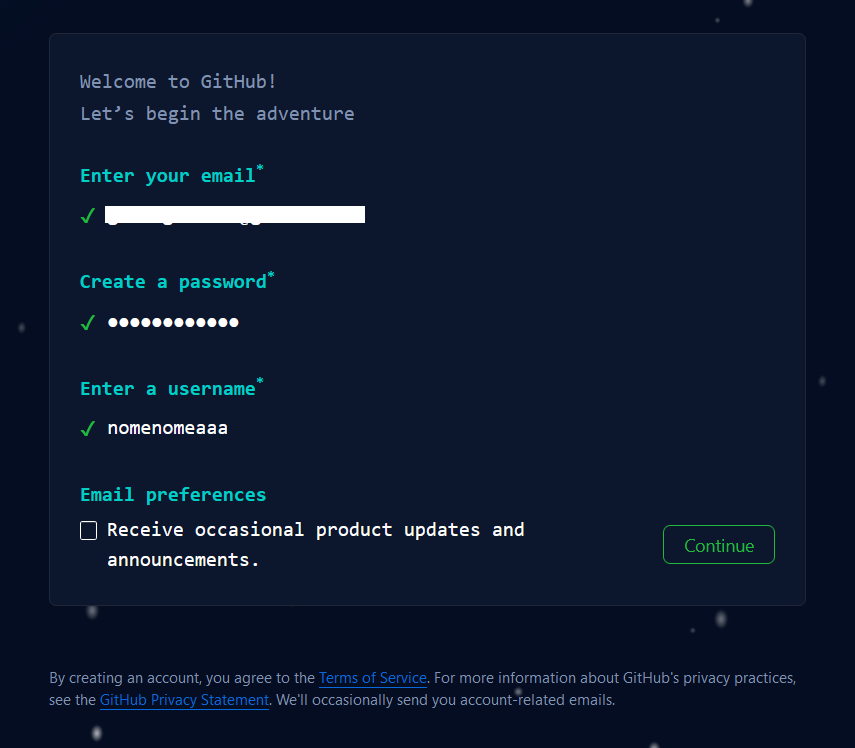
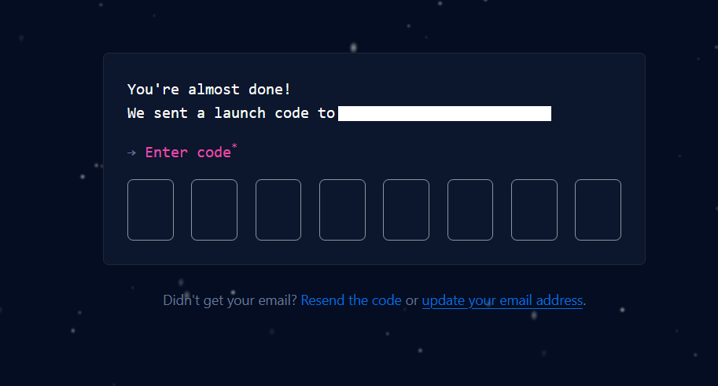
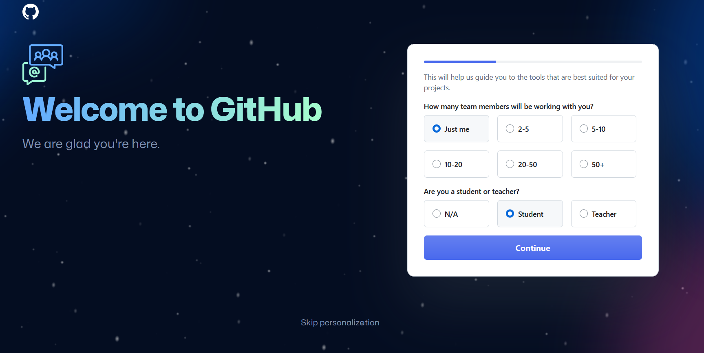
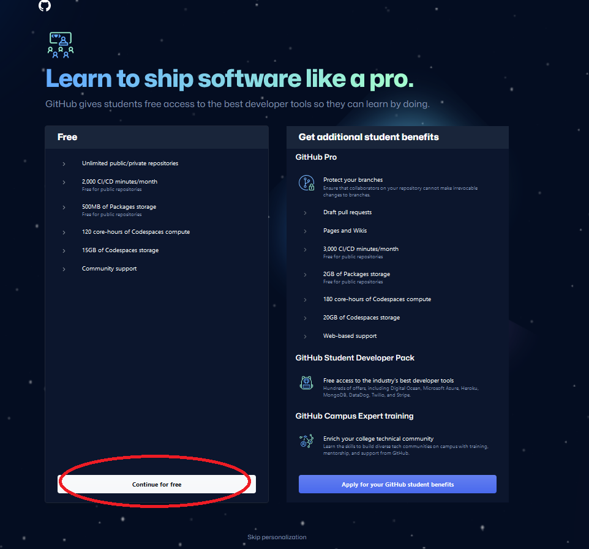
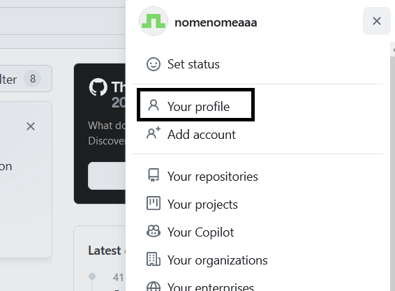
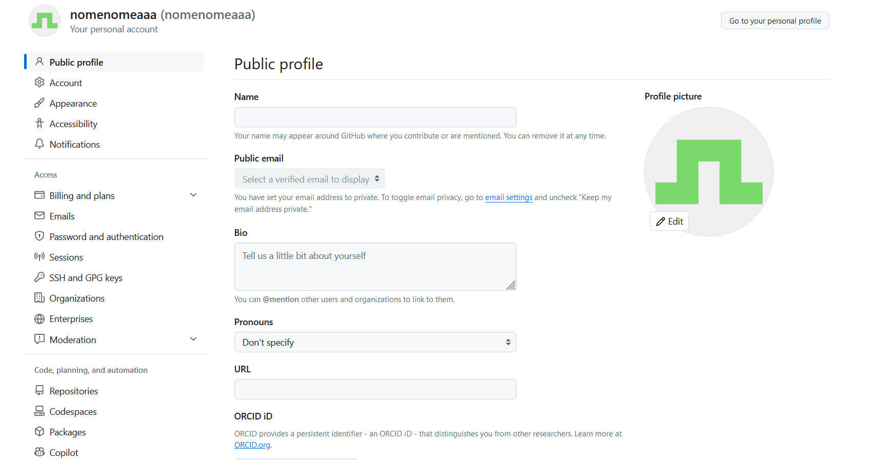
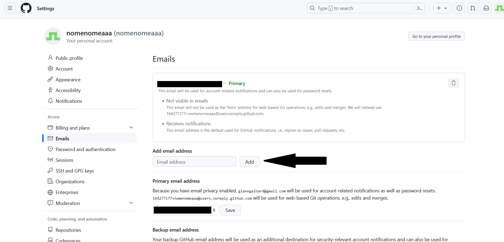
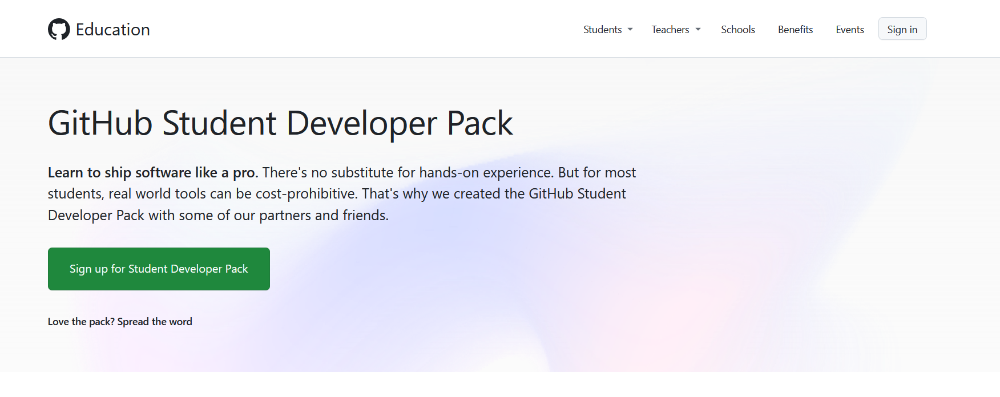
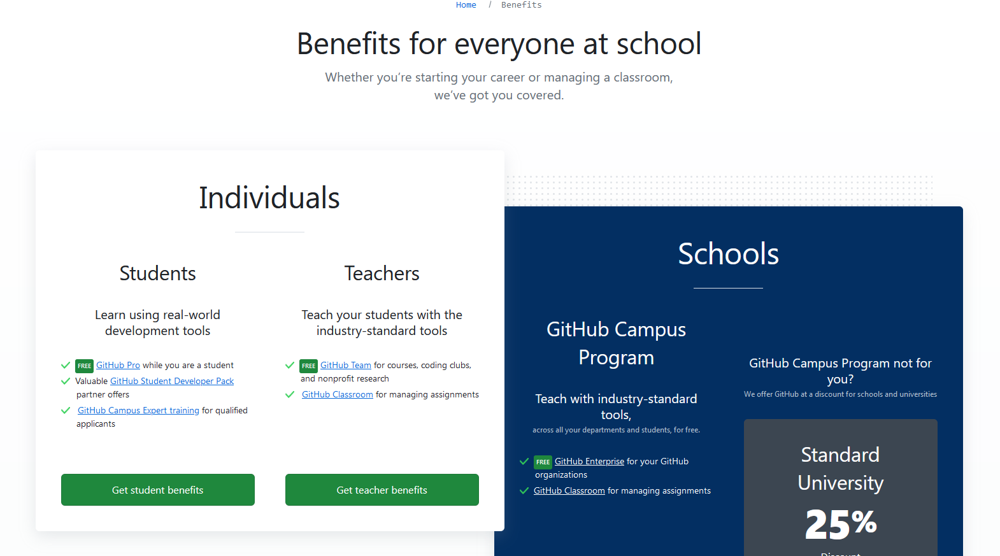
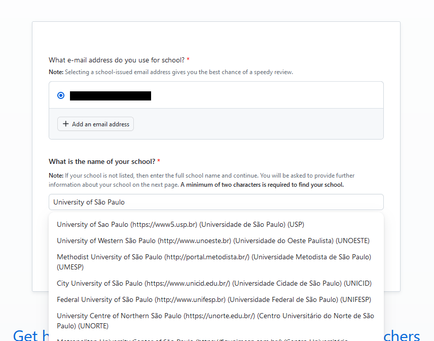

# Como criar uma conta no Github?

O Github é uma das plataformas fundamentais para qualquer desenvolvedor. Ele permite que você crie, armazene, gerencie e compartilhe seu código. O Github utiliza o Git, que é um software de versionamento de código.

Com o Github, é possível, por exemplo, criar um repositório para um trabalho de código da faculdade. Esse repositório pode ser compartilhado e editado por várias pessoas ao mesmo tempo.

Além disso, com o Github Student Developer Pack, estudantes de graduação possuem acesso gratuito a diversos cursos e ferramentas de desenvolvimento.

Para **criar**, **personalizar** e **adquirir benefícios** com sua conta no Github, siga esses passos:

## Criando a conta

1. Entre em https://github.com/, insira seu e-mail em "Email address" e clique em "Sign up for Github".

2. Preencha cada informação e clique em "Continue". Você deverá escolher um e-mail, uma senha e um nome de usuário.

3. Insira o código que vai aparecer no seu e-mail escolhido.

4. Você pode responder algumas perguntas para receber sugestões de ferramentas personalizadas, mas não é obrigatório. Caso não queira responder, aperte em "Skip personalization".

5. Caso apareça a opção, escolha o plano gratuito.

Parabéns! Sua conta está criada :)

## Personalizando a conta

Em sua conta do Github, você pode expor url de outras redes sociais, um nome personalizado, uma foto de perfil e outras personalizações.

1. Clique no ícone de perfil no canto superior direito da tela e, depois, escolha "Your profile"

2. Fique à vontade para colocar as informações que achar necessárias. Ao final, clique em "Save" no final da página.

## Adquirindo benefícios com GitHub Student Developer Pack

O **Github Student Developer Pack** é um programa criado pelo Github para ajudar os alunos a terem acesso à ferramentas e cursos profissionais de desenvolvimento de software de forma gratuita. Para participar do programa, basta ser maior que 13 anos e estar matriculado em uma instituição de ensino (não há limitações sobre curso ou instituição.)

Algumas ferramentas disponíveis no Github Student Developer Pack são:
- Github Copilot
- Microsoft Azure
- Streamyard
- Namecheap

Algumas plataformas de curso que podem ser utilizadas com o pacote são:
- Educative
- Frontend Masters
- Datacamp

Veja todas oportunidades aqui: https://education.github.com/pack

Para utilizar o benefício, você deve:

1. Caso não tenha criado sua conta do github com e-mail institucional, vá novamente nas configurações de sua conta > Aba Emails > Adicione seu e-mail institucional (para estudantes da USP, o e-mail @usp.br)

2. Após salvar, entre em https://education.github.com/ e clique em "Join Global Campus"

3. Depois, clique em "Sign up for Student Developer Pack"

4. Clique em "Get student benefits"

5. Selecione seu e-mail institucional e procure o nome da sua instituição de ensino na lista.

6. Explique o motivo de você querer participar do programa (não é necessário ser muito específico)

7. Caso peçam, envie foto de sua carteirinha de estudante (frente e verso) para validar suas informações

Após isso, será necessário esperar alguns dias para que analisem seu perfil e dêem a resposta!